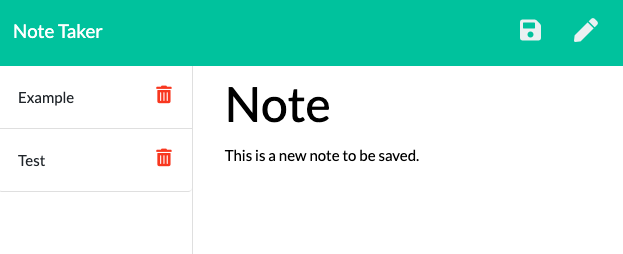

# Note Taker

## About
An app that allows a user to save and delete notes by utilizing Express.js GET, POST, and DELETE api routes. Made using HTML, CSS, JavaScript, Node.js, Express.js, and UUID.

## Usage
The user can add and save new notes, as well as view and delete existing notes.

## Screenshot

## Link to Deployed Site
https://hidden-falls-03672.herokuapp.com/